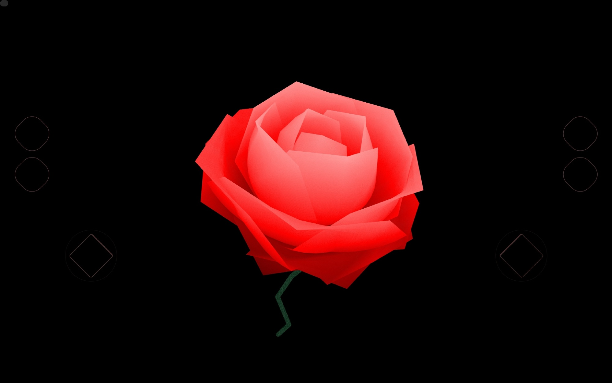

# Triadica Space

> toy project rendering 3D with math and shader, without a framework. named with ["Triadica sebifera"](./assets/triadica.jpg).

- Live Demo https://r.tiye.me/Quatrefoil-GL/triadica-space/
  URL Parameters:
  - `effects=on/off`
  - `dev=release/dev`
  - `hide-tabs=true/false`
  - `tab=axis/lamps/...`
- Docs https://github.com/triadica/guidebook/
- [DevLog videos(Chinese)](https://space.bilibili.com/14227306/channel/seriesdetail?sid=2606248)
- [Artworks with Triadica](https://www.ixigua.com/home/3166205900759127/video/?keyword=triadica&list_entrance=userdetail)

[](https://www.ixigua.com/iframe/7128061977837961741?autoplay=0&startTime=25)

### Object definition

For example:

```cirru
object $ {} (:draw-mode :lines)
  :vertex-shader $ inline-shader "\"shape.vert"
  :fragment-shader $ inline-shader "\"shape.frag"
  :points $ map geo
    fn (p)
      -> p
        map $ fn (i)
          * i 40
        &v+  $ [] 400 300 -1200
  :indices indices
  :hit-region $ {}
    :position $ [] 400 300 -1200
    :radius 20
    :on-hit $ fn (e d!)
      js/alert "\"hit on cube"
    :on-mousedown $ fn (e d!)
    :on-mousemove $ fn (e d!)
    :on-mouseup $ fn (e d!)
```

- `:draw-mode` supports `:lines`, `:triangles`, `:line-strip`
- `*-shader` is a text of shader string
- `:points`
- `:indices`, optional, list of numbers
- `:attributes`, a list of points or floats
- `:hit-region`, enables click detection

### Inspirations

- Project encouraged by https://github.com/doodlewind/beam
- Curly Ball demo inspired by https://twitter.com/scdollins/status/1531690190439215104
- Spin City demo inspired by https://twitter.com/MAKIO135/status/1525347172861939713

Core logics is based on twgl.js https://gist.github.com/tiye/d722a824d981a968da20be5fee7a4cb9 .

### Workflow

https://github.com/Triadica/triadica-workflow

### License

MIT
