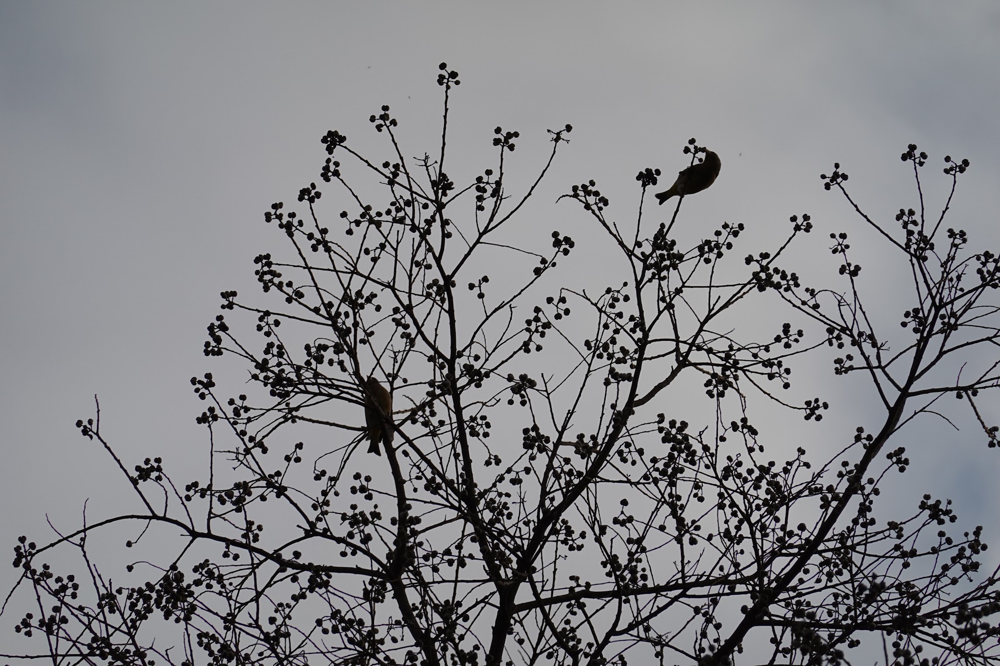

# Triadica Space

> toy project rendering 3D with math and shader, without a framework.

- Live Demo https://r.tiye.me/Quatrefoil-GL/triadica-space/

### Object definition

For example:

```cirru
object $ {} (:draw-mode :lines)
  :vertex-shader $ inline-shader "\"shape.vert"
  :fragment-shader $ inline-shader "\"shape.frag"
  :points $ map geo
    fn (p)
      -> p
        map $ fn (i)
          * i 40
        &v+  $ [] 400 300 -1200
  :indices indices
  :hit-region $ {}
    :position $ [] 400 300 -1200
    :radius 20
    :on-hit $ fn (e d!)
      js/alert "\"hit on cube"
    :on-mousedown $ fn (e d!)
    :on-mousemove $ fn (e d!)
    :on-mouseup $ fn (e d!)
```

- `:draw-mode` supports `:lines`, `:triangles`, `:line-strip`
- `*-shader` is a text of shader string
- `:points`
- `:indices`, optional, list of numbers
- `:attributes`, a list of points or floats
- `:hit-region`, enables click detection

### Math

TODO: diagram.

viewport projection from 3d vectors(not accurate enough when rotating):

```cirru
vec3 moved_point = a_position - cameraPosition;

float s = coneBackScale;

float x = moved_point.x;
float y = moved_point.y;
float z = moved_point.z;

float a = lookPoint.x;
float b = lookPoint.y;
float c = lookPoint.z;

float r = (a*x + b*y + c*z) / sumSquares3(a, b, c);
float q = (s + 1.0) / (r + s);
float l1 = sqrt((a*a*b*b) + square(sumSquares2(a,c)) + (b*b*c*c));

float y_next = (q*y + b*q*s - b*s - b) / sumSquares2(a, c) * l1;
float x_next = (((q*x + a*q*s - a*s - a) - (y_next * (-a * b) / l1)) / -c) * sqrt(sumSquares2(a,c));;
float z_next = -r;

vec3 pos_next = vec3(x_next, y_next / viewportRatio, z_next);

z_color = r;
gl_Position = vec4(pos_next * 0.0002, 1.0);
```

### Inspirations

- Project encouraged by https://github.com/doodlewind/beam
- Curly Ball demo inspired by https://twitter.com/scdollins/status/1531690190439215104
- Spin City demo inspired by https://twitter.com/MAKIO135/status/1525347172861939713

### Naming

The name project form can from:



### License

MIT
